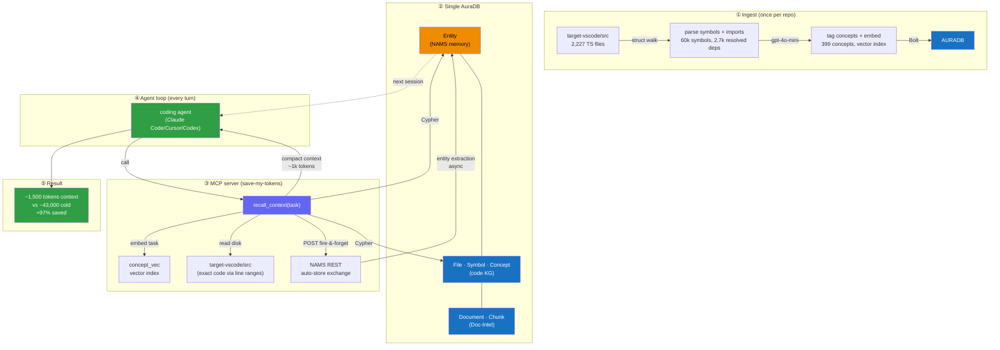
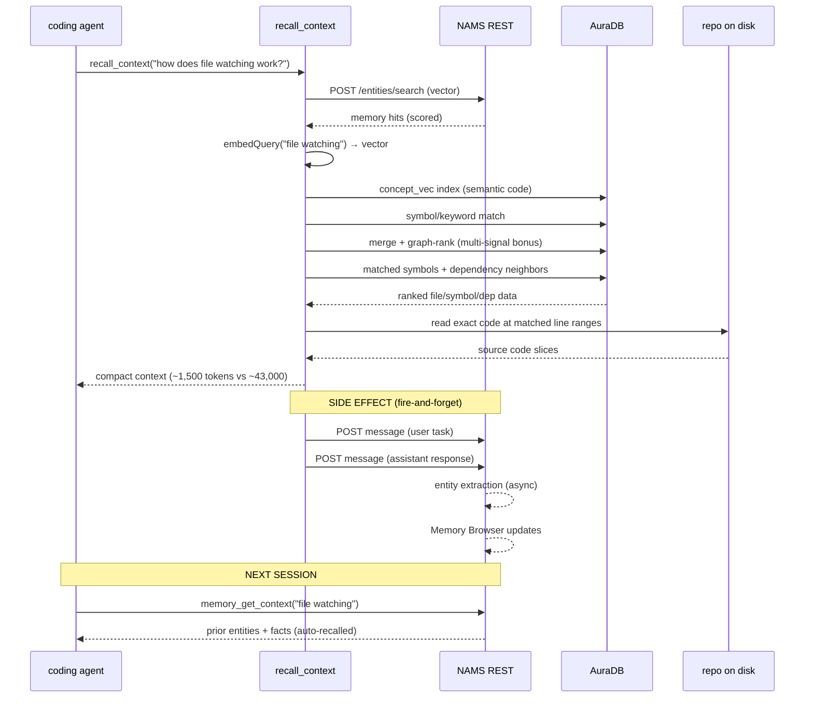
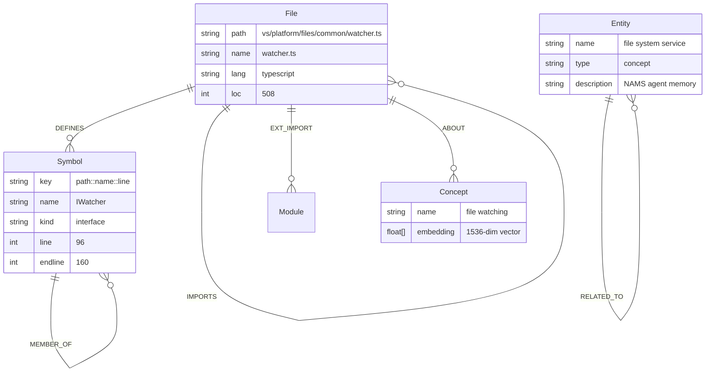

# Save My Tokens — demo runbook (for judging)

**Pitch:** coding agents re-discover the same project every new session, burning thousands of
tokens. Save My Tokens gives them persistent memory (NAMS) + a vertical codebase knowledge graph
(AuraDB Doc-Intelligence) so a warm session recalls instead of re-reading. Same task, far fewer
tokens — with *exact code* read from disk via graph line-ranges.

Both required integrations are used:

- **Aura Document Intelligence** + hybrid ingest → vertical codebase KG in AuraDB.
- **NAMS** (Neo4j Agent Memory Service) → durable facts + injected file summaries across sessions.
- `connector/mcp_server.py` is the **real-time MCP bridge**: `recall_context`, `index_file`, `remember_fact`.

---

## Architecture



### Flow (per turn)



### Data model (what lives in the one AuraDB)




## 0. Setup (once)

- `pip install -r connector/requirements.txt`
- `.env` holds `NEO4J_*`, `NAMS_API_KEY`, `NAMS_WORKSPACE_ID`, `OPENAI_API_KEY`.
- Clone + sparse-checkout the test bed:
  ```
  git clone --no-checkout --depth 1 --filter=blob:none https://github.com/microsoft/vscode target-vscode
  cd target-vscode && git sparse-checkout set src/vs/platform src/vs/base && git checkout
  ```

## 1. Generate the vertical graph

```
python3 connector/ingest_repo.py target-vscode/src --llm --llm-limit 250
```

- Deterministic walk: 2,227 TS files, 24,682 symbols (class/interface/enum/function/method/const)
- Vertical edges: **2,736 resolved File→File IMPORTS** (traversable dep chains),
  **11,352 method→class MEMBER_OF** containment edges, 10,313 external imports
- gpt-4o-mini: 399 Concept nodes with 750 ABOUT edges
- Line ranges on every Symbol — no code stored, retriever reads exact slice from disk

## 2. Embed concepts (semantic recall)

```
python3 connector/embed_kg.py
```

- Embeds 399 Concept nodes (`text-embedding-3-small`) → `concept_vec` vector index

## 3. Seed memory or let the agent write it

- `remember_fact("prefers no comments", "Code is self-documenting", "convention")`
- `index_file("vs/base/common/event.ts")` — deep-indexes on demand (147 symbols, 11 deps),
  injects summary into NAMS for next session

## 4. The real-time bridge — token proof

```
python3 connector/context_engine.py "how does the file service watch for changes"
```

**Verified results on vscode:**

| Query                           | Files matched | Cold (full read) | Warm (our ctx) | Saved           |
| ------------------------------- | ------------- | ---------------- | -------------- | --------------- |
| "undo and redo stack for edits" | 6             | 45,667 tokens    | 954 tokens     | **97.9%** |
| "file watcher event handling"   | 6             | 24,509 tokens    | 860 tokens     | **96.5%** |
| "how does session signing work" | 6             | 9,344 tokens     | 310 tokens     | **96.7%** |

Each warm context includes:

- **Recalled memory** (NAMS vector search, scored, with full descriptions)
- **Graph-ranked files** with *why* each matched (concept tags + keyword signals)
- **Matched symbols** (class/interface/function, exact line numbers)
- **Dependency neighbors** (what each file imports)
- **Exact code** read from disk via KG line ranges

## 5. The MCP server (real-time, no manual script)

`connector/mcp_server.py` — 3 tools, registered as `save-my-tokens` in `.mcp.json`:

- `recall_context(task)` — the full vertical retrieval, call before reading files
- `index_file(path)` — deep-index one file (parse + AuraDB + NAMS summary)
- `remember_fact(name, description, type)` — persist to NAMS

Any agent (Claude Code/Cursor/Codex): "call recall_context before exploring; remember_fact when you learn something durable; index_file when you open a new file."

## 6. Show the graphs

- AuraDB Browser: `MATCH p=(f:File)-[:IMPORTS]->(d:File) RETURN p LIMIT 100` — dependency chains
- Aura Query: `MATCH (f:File)-[:DEFINES]->(c:Symbol {kind:'class'})<-[:MEMBER_OF]-(m) RETURN f,c,m LIMIT 50` — containment
- NAMS console (memory.neo4jlabs.com): entities growing as the agent works
- **The combine**: NAMS memory + code KG share the **same AuraDB** (dbMode=external).
  Bridge = single Cypher join: `MATCH (mem:Entity) ... MATCH (c:Concept) WHERE c.name = mem.canonicalName`

## Talk track (30s)

"Every new agent session relearns your repo — tens of thousands of tokens, every time. We build
a vertical knowledge graph: 2,227 files, 24,000 symbols with containment, 2,700 resolved import
edges you can traverse — plus a semantic concept layer via embeddings. Agent memory persists what
the agent learns across sessions. Next session, the bridge joins memory + graph and returns a
few hundred tokens of exactly relevant context — matched symbols with line numbers, dependency
neighbors, and the real code read from disk. 97% less context, same answer, and because both
memory and code live in one graph, they join on shared entities."
